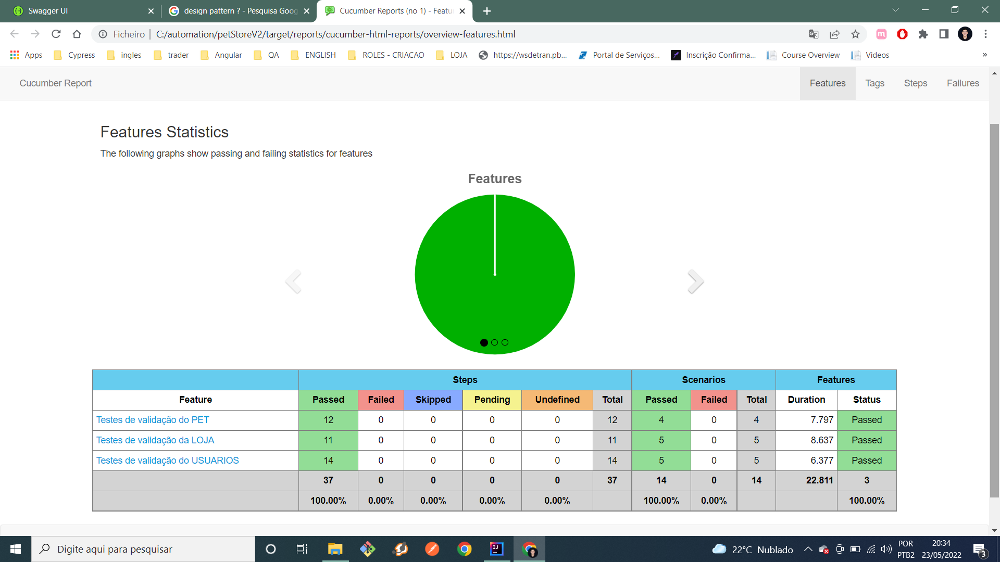

# petStoreV2
Projeto de Automação de API construído com: Java, Cucumber, BDD, Gherkin, Junit, Rest-Assured.

O projeto foi feito com a arquitetura do page object, utilizando o padrão de design patter.
Atendendo os principais metodos do swagger PetStore.
Foi criado também um db com dois arquivos json para alimentar a massa de dados para a automação.
E por fim, foi incrementado também um plugin para fazer/gerar o relatorio com o resultado de todos os testes.

Automação realizada com base no Swagger:
https://petstore.swagger.io/#/

